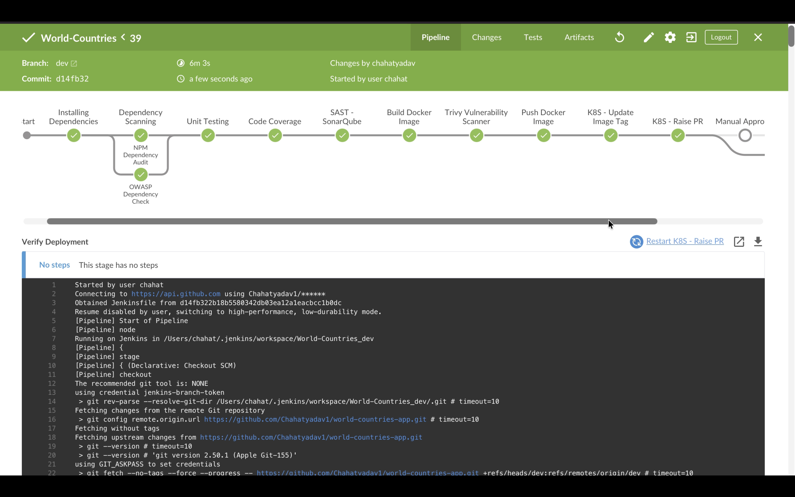
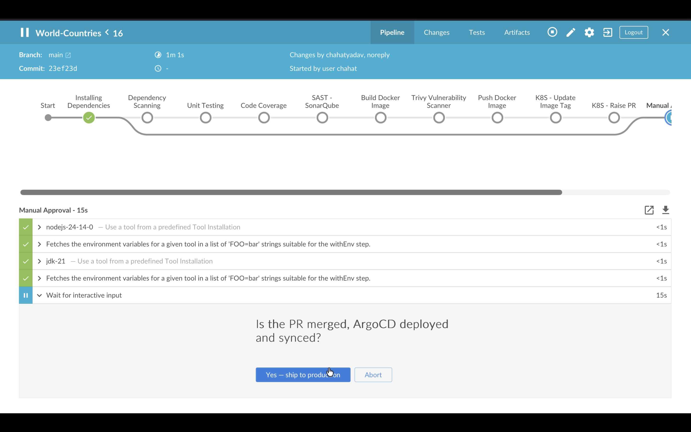
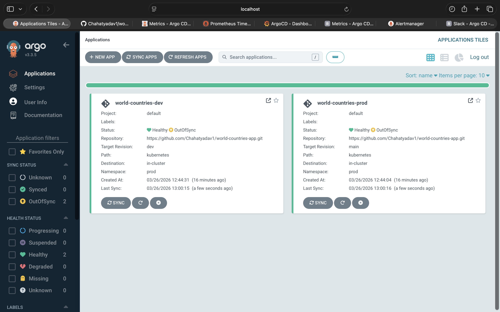
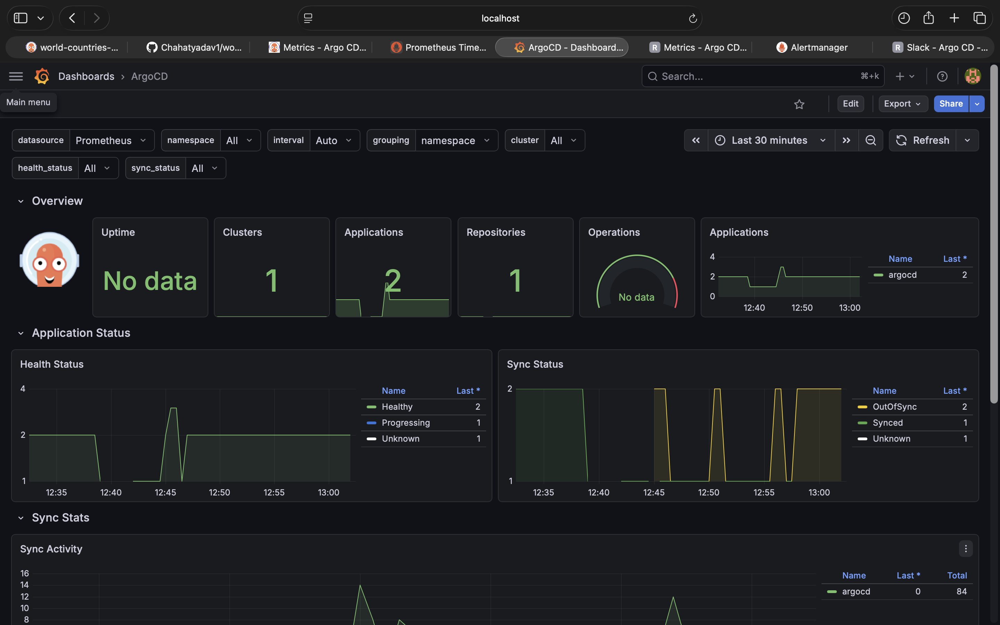
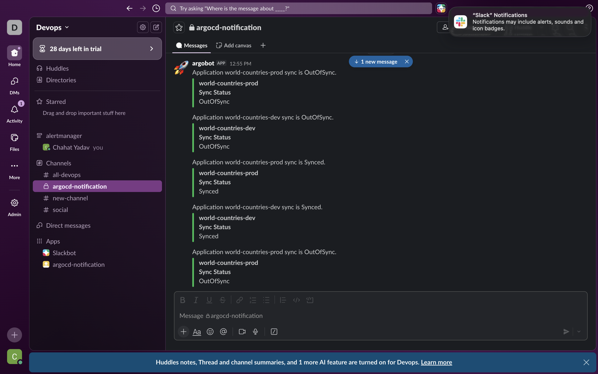

# 🌍 World Countries App — Full DevSecOps CI/CD Pipeline

<div align="center">


**A production-grade Node.js REST API with a complete DevSecOps pipeline — from commit to Kubernetes, fully automated.**

[Live Demo](#) · [API Docs](#api-endpoints) · [Pipeline Overview](#cicd-pipeline)

</div>

---

## 📸 Screenshots

> 💡 **Tip:** Add screenshots in this section for maximum GitHub impact.
> Suggested images to capture and drop into `docs/images/`:
> - `pipeline-overview.png` — Jenkins Blue Ocean full pipeline view
> - `argocd-dashboard.png` — ArgoCD app sync view (green ✅)
> - `grafana-dashboard.png` — Grafana monitoring dashboard
> - `sonar-report.png` — SonarQube quality gate passed
> - `slack-notification.png` — ArgoCD Slack alert in channel
> - `app-ui.png` — The running frontend (index.html)
> - `trivy-report.png` — Trivy vulnerability scan results

| Pipeline-dev | Pipeline-main | ArgoCD | Grafana | Slack | App-UI | Sonar-Qube |
|--------------|---------------|---------|--------|-------|--------|------------|
|  |   |  |  |  |  |  |

---

## 🏗️ Architecture

```
┌─────────────────────────────────────────────────────────────────────┐
│                        Developer Workstation                         │
│                    git push → GitHub (dev branch)                    │
└──────────────────────────────┬──────────────────────────────────────┘
                               │ Webhook
                               ▼
┌─────────────────────────────────────────────────────────────────────┐
│                          Jenkins CI Server                           │
│                                                                      │
│  Install Deps → Dep Scan (NPM Audit + OWASP) → Unit Tests           │
│      → Code Coverage → SAST (SonarQube) → Docker Build              │
│      → Trivy Image Scan → Push to DockerHub                         │
│      → Update K8s Manifest → Raise PR to main                       │
└──────────────────────────────┬──────────────────────────────────────┘
                               │ PR Merge to main
                               ▼
┌─────────────────────────────────────────────────────────────────────┐
│                      ArgoCD (GitOps Controller)                      │
│   Watches GitHub main branch → Detects manifest change              │
│   → Syncs Kubernetes cluster → Sends Slack notification             │
└──────────────────────────────┬──────────────────────────────────────┘
                               │
                               ▼
┌─────────────────────────────────────────────────────────────────────┐
│                        Kubernetes Cluster                            │
│                                                                      │
│  ┌──────────────────────┐     ┌───────────────────────────────────┐ │
│  │   world-countries    │     │            MongoDB                │ │
│  │   Deployment (x2)    │────▶│         Deployment (x1)           │ │
│  │   Port: 3000         │     │         Port: 27017               │ │
│  └──────────┬───────────┘     └───────────────────────────────────┘ │
│             │                                                        │
│  ┌──────────▼───────────┐     ┌───────────────────────────────────┐ │
│  │   ClusterIP Service  │     │    Prometheus + Grafana Stack     │ │
│  │   Port: 8080 → 3000  │     │    (kube-prometheus-stack)        │ │
│  └──────────────────────┘     └───────────────────────────────────┘ │
└─────────────────────────────────────────────────────────────────────┘
```

---

## ✨ Features

- **REST API** — Query world countries data (name, capital, population, continent, currency)
- **MongoDB** — Persistent data layer with auto-seeding on first boot
- **Health Endpoints** — `/live` and `/ready` for Kubernetes liveness/readiness probes
- **API Documentation** — OpenAPI 3.0 spec at `/api-docs`
- **Full CI/CD** — Zero-touch delivery from `git push` to production

---

## 🔐 Security Pipeline (DevSecOps)

| Stage | Tool | What It Checks |
|-------|------|----------------|
| Dependency Audit | `npm audit` | Known CVEs in npm packages |
| Dependency Check | OWASP Dependency-Check | CVE database scan with NVD API |
| SAST | SonarQube | Code quality, bugs, security hotspots |
| Container Scan | Trivy | OS + library CVEs in Docker image |
| Secret Detection | `.gitignore` + K8s Secrets | No plaintext credentials in repo |

---

## 🚀 CI/CD Pipeline

### Branch Strategy

```
main   ──────────────────────────●─────── Production (ArgoCD deploys)
                                 ↑ PR Merge
dev    ─●───●───●───●───●────────           Feature development + CI
```

### Pipeline Stages (Jenkins)

```
dev branch:
  Installing Dependencies
       ↓
  Dependency Scanning ─────────────────┐
  ├─ NPM Dependency Audit              │ (parallel)
  └─ OWASP Dependency Check ───────────┘
       ↓
  Unit Testing  (retry: 2)
       ↓
  Code Coverage
       ↓
  SAST - SonarQube
       ↓
  Build Docker Image
       ↓
  Trivy Vulnerability Scanner
       ↓
  Push Docker Image → DockerHub
       ↓
  K8s - Update Image Tag in manifest
       ↓
  K8s - Raise PR (dev → main)

main branch (after PR merge):
  Manual Approval Gate
       ↓
  Verify Deployment
```

---

## 📡 Monitoring Stack

### Prometheus + Grafana (kube-prometheus-stack)

Deployed via Helm with custom values. Monitors:

- **Application** — HTTP request rate, latency, error rate (via ServiceMonitor)
- **Kubernetes** — Pod CPU/memory, deployment replica health
- **ArgoCD** — Sync status, health status, operation duration
- **MongoDB** — Connection pool, operation latency

### Custom Alerts

| Alert | Severity | Trigger |
|-------|----------|---------|
| `ArgoCDAppOutOfSync` | Warning | ArgoCD app out-of-sync for > 5 min |

### Grafana Dashboard

Import `grafana/world-countries-dashboard.json` into Grafana.

Panels included:
- HTTP Request Rate (by endpoint)
- P95 Response Latency
- Error Rate %
- Pod CPU & Memory Usage
- ArgoCD Sync/Health Status
- MongoDB Active Connections

---

## 📂 Project Structure

```
world-countries-app/
├── app.js                          # Express server + REST API
├── app-test.js                     # Mocha/Chai test suite
├── index.html                      # Frontend UI
├── oas.json                        # OpenAPI 3.0 spec
├── Dockerfile                      # Multi-stage container build
├── Jenkinsfile                     # Full CI pipeline definition
├── package.json
├── dependency-check-suppression.xml
├── trivy-templates/
│   ├── html.tpl                    # Trivy HTML report template
│   └── junit.tpl                   # Trivy JUnit report template
├── kubernetes/
│   ├── AppDeployment.yaml          # App Deployment (2 replicas)
│   ├── AppService.yaml             # ClusterIP Service
│   ├── MongoDeployment.yaml        # MongoDB Deployment
│   ├── MongoService.yaml           # MongoDB ClusterIP Service
│   └── Secret.yaml                 # K8s Secret (⚠️ use Sealed Secrets in prod)
├── argocd/
│   ├── application.yaml            # ArgoCD Application manifest
│   └── notifications-cm.yaml      # ArgoCD Slack notifications
├── prometheus/
│   └── alert-rules.yaml            # PrometheusRule CRD
└── grafana/
    └── world-countries-dashboard.json  # Importable Grafana dashboard
```

---

## 🛠️ Local Development

### Prerequisites

- Node.js 20+
- Docker & Docker Compose
- MongoDB (local or Atlas URI)

### Run Locally

```bash
# Clone the repo
git clone https://github.com/Chahatyadav1/world-countries-app.git
cd world-countries-app

# Install dependencies
npm install

# Set environment variables
export MONGO_URI="mongodb://localhost:27017"
export MONGO_USERNAME="admin"
export MONGO_PASSWORD="password"

# Start the server
npm start
# → Server running on http://localhost:3000
```

### Run Tests

```bash
npm test                  # Run test suite
npm run coverage          # Run with code coverage report
```

### Run with Docker

```bash
docker build -t world-countries:local .
docker run -p 3000:3000 \
  -e MONGO_URI=mongodb://host.docker.internal:27017 \
  -e MONGO_USERNAME=admin \
  -e MONGO_PASSWORD=password \
  world-countries:local
```

---

## 📌 API Endpoints

| Method | Endpoint | Description |
|--------|----------|-------------|
| `GET` | `/` | Frontend UI |
| `POST` | `/country` | Get country by ID `{ "id": 1 }` |
| `GET` | `/api-docs` | OpenAPI 3.0 specification |
| `GET` | `/os` | Hostname + environment info |
| `GET` | `/live` | Liveness probe |
| `GET` | `/ready` | Readiness probe |

### Example Request

```bash
curl -X POST http://localhost:3000/country \
  -H "Content-Type: application/json" \
  -d '{"id": 1}'
```

```json
{
  "id": 1,
  "name": "India",
  "capital": "New Delhi",
  "population": "1.4 billion",
  "continent": "Asia",
  "currency": "Indian Rupee"
}
```

---

## ☸️ Kubernetes Deployment

### Apply Manifests Manually

```bash
# Create namespace (if needed)
kubectl create namespace world-countries

# Apply secrets first
kubectl apply -f kubernetes/Secret.yaml -n world-countries

# Deploy MongoDB
kubectl apply -f kubernetes/MongoDeployment.yaml -n world-countries
kubectl apply -f kubernetes/MongoService.yaml -n world-countries

# Deploy App
kubectl apply -f kubernetes/AppDeployment.yaml -n world-countries
kubectl apply -f kubernetes/AppService.yaml -n world-countries

# Verify
kubectl get pods -n world-countries
kubectl get svc -n world-countries
```

### ArgoCD GitOps Deployment

```bash
# Apply the ArgoCD application manifest
kubectl apply -f argocd/application.yaml -n argocd

# Watch sync status
argocd app get world-countries
argocd app sync world-countries
```

---

## 🔔 Slack Notifications

ArgoCD sends Slack notifications on:
- ✅ Sync **Succeeded**
- ❌ Sync **Failed**
- ⚠️ App **Out of Sync** (via Prometheus alert → AlertManager)

Setup:
1. Create a Slack bot and copy the OAuth token
2. `kubectl create secret generic argocd-notifications-secret --from-literal=slack-token=<YOUR_TOKEN> -n argocd`
3. `kubectl apply -f argocd/notifications-cm.yaml -n argocd`

---

## 🔧 Jenkins Credentials Required

| Credential ID | Type | Usage |
|---------------|------|-------|
| `mongo-db-credentials` | Username/Password | MongoDB Atlas (combined) |
| `mongouser` | Secret Text | MongoDB username |
| `mongopassword` | Secret Text | MongoDB password |
| `nvd-api-key` | Secret Text | OWASP NVD API key |
| `docker-creds` | Username/Password | DockerHub push |
| `GitHub-token-text` | Secret Text | GitHub PR creation via `gh` CLI |

---

## ⚡ Production Recommendations

## 📊 Tech Stack

| Layer | Technology |
|-------|------------|
| Runtime | Node.js 20 on Alpine 3.19 |
| Framework | Express.js |
| Database | MongoDB via Mongoose |
| Containerization | Docker |
| Orchestration | Kubernetes |
| CI | Jenkins (declarative pipeline) |
| CD / GitOps | ArgoCD |
| SAST | SonarQube |
| Image Scanning | Trivy |
| Dependency Scanning | OWASP Dependency-Check + npm audit |
| Monitoring | Prometheus + kube-prometheus-stack |
| Dashboarding | Grafana |
| Alerting | AlertManager → Slack |
| Notifications | ArgoCD Notifications → Slack |
| Testing | Mocha + Chai |
| Coverage | NYC (Istanbul) |
| API Spec | OpenAPI 3.0 |

---

## 📄 License

MIT License — see [LICENSE](LICENSE) for details.

---

<div align="center">

Built with ❤️ by [Chahat Yadav](https://github.com/Chahatyadav1)

⭐ If this project helped you, please star it!

</div>
