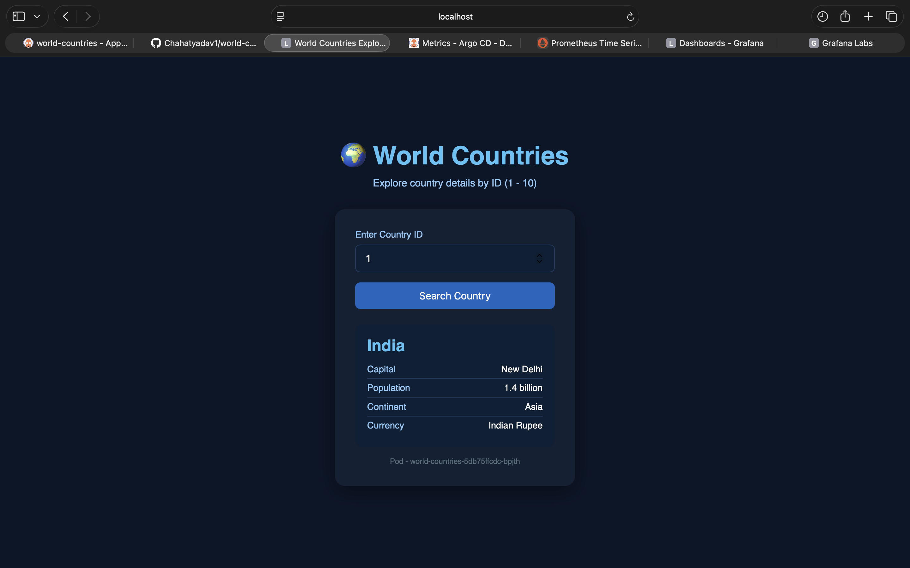
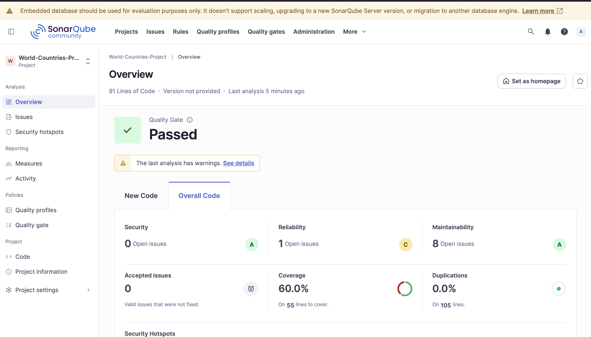

# 🌍 World Countries App — Full DevSecOps CI/CD Pipeline

<div align="center">


**A production-grade Node.js REST API with a complete DevSecOps pipeline — from commit to Kubernetes, fully automated.**

[API Docs](#-api-endpoints) · [Pipeline Overview](#-cicd-pipeline) · [Local Setup](#️-local-development)

</div>

---

## 📸 Screenshots

| Pipeline (dev) | Pipeline (main) | ArgoCD | Grafana | Slack | App UI | SonarQube |
|:-:|:-:|:-:|:-:|:-:|:-:|:-:|
|  |  |  |  |  |  |  |

---

## 🏗️ Architecture

```
┌──────────────────────────────────────────────────────────────────────┐
│                        Developer Workstation                          │
│                    git push → GitHub (dev branch)                     │
└───────────────────────────────┬──────────────────────────────────────┘
                                │ Webhook
                                ▼
┌──────────────────────────────────────────────────────────────────────┐
│                          Jenkins CI Server                            │
│                                                                       │
│  Install Deps → Dep Scan (NPM Audit + OWASP) → Unit Tests            │
│      → Code Coverage → SAST (SonarQube) → Docker Build               │
│      → Trivy Image Scan → Push to DockerHub                          │
│      → Update K8s Manifest → Raise PR to main                        │
└───────────────────────────────┬──────────────────────────────────────┘
                                │ PR Merge to main
                                ▼
┌──────────────────────────────────────────────────────────────────────┐
│                      ArgoCD (GitOps Controller)                       │
│   Watches GitHub main branch → Detects manifest change               │
│   → Syncs Kubernetes cluster → Sends Slack notification              │
└───────────────────────────────┬──────────────────────────────────────┘
                                │
                                ▼
┌──────────────────────────────────────────────────────────────────────┐
│                        Kubernetes Cluster                             │
│                                                                       │
│  ┌───────────────────────┐     ┌──────────────────────────────────┐  │
│  │   world-countries     │     │           MongoDB                │  │
│  │   Deployment (x2)     │────▶│        Deployment (x1)           │  │
│  │   Port: 3000          │     │        Port: 27017               │  │
│  └───────────┬───────────┘     └──────────────────────────────────┘  │
│              │                                                        │
│  ┌───────────▼───────────┐     ┌──────────────────────────────────┐  │
│  │   ClusterIP Service   │     │   Prometheus + Grafana Stack     │  │
│  │   Port: 8080 → 3000   │     │   (kube-prometheus-stack)        │  │
│  └───────────────────────┘     └──────────────────────────────────┘  │
└──────────────────────────────────────────────────────────────────────┘
```

---

## ✨ Features

- **REST API** — Query world countries data (name, capital, population, continent, currency)
- **MongoDB** — Persistent data layer with auto-seeding on first boot
- **Health Endpoints** — `/live` and `/ready` for Kubernetes liveness/readiness probes
- **API Documentation** — OpenAPI 3.0 spec served at `/api-docs`
- **Full CI/CD** — Zero-touch delivery from `git push` to production

---

## 📂 Project Structure

```
world-countries-app/
│
├── app.js                              # Express server & REST API logic
├── app-test.js                         # Mocha + Chai unit test suite
├── index.html                          # Frontend UI (country lookup)
├── oas.json                            # OpenAPI 3.0 specification
├── Dockerfile                          # Node.js 20-Alpine container image
├── Jenkinsfile                         # Declarative Jenkins CI/CD pipeline
├── package.json                        # npm metadata, scripts & dependencies
├── package-lock.json                   # Locked dependency tree
├── dependency-check-suppression.xml    # OWASP false-positive suppressions
├── zap_ignore_rules                    # OWASP ZAP scan ignore rules
│
├── images/                             # Screenshots used in README
│   ├── app-ui.png
│   ├── pipeline-dev.png
│   ├── pipeline-main.png
│   ├── argocd.png
│   ├── grafana-dashboard.png
│   ├── slack.png
│   └── sonar-qube.png
│
├── trivy-templates/                    # Custom Trivy report templates
│   ├── html.tpl                        # HTML vulnerability report
│   └── junit.tpl                       # JUnit XML report (for Jenkins)
│
├── kubernetes/                         # Kubernetes manifests
│   ├── AppDeployment.yaml              # App Deployment — 2 replicas, pulls from DockerHub
│   ├── AppService.yaml                 # ClusterIP Service (port 8080 → 3000)
│   ├── MongoDeployment.yaml            # MongoDB Deployment (single replica)
│   ├── MongoService.yaml               # MongoDB ClusterIP Service (port 27017)
│   ├── Secret.yaml                     # K8s Secret — MONGO_URI, USERNAME, PASSWORD
│   └── selaed-secret.cert              # Sealed Secrets public certificate
│
├── Argocd/                             # ArgoCD GitOps manifests
│   ├── application-dev.yaml            # ArgoCD Application — dev branch → prod namespace
│   ├── application-prod.yaml           # ArgoCD Application — main branch → prod namespace
│   ├── notification-cm.yaml            # Slack notification ConfigMap
│   ├── notification-secret.yaml        # ArgoCD notifications Slack token secret
│   ├── service-monitor.yaml            # Prometheus ServiceMonitor CRD
│   └── sealed-secret.cert              # Sealed Secrets certificate (ArgoCD copy)
│
└── prometheus/
    └── prometheus-rule.yaml            # PrometheusRule — ArgoCDAppOutOfSync alert
```

---

## 🔐 Security Pipeline (DevSecOps)

| Stage | Tool | What It Checks |
|-------|------|----------------|
| Dependency Audit | `npm audit` | Known CVEs in npm packages |
| Dependency Check | OWASP Dependency-Check | Full CVE database scan via NVD API |
| SAST | SonarQube | Code quality, bugs, security hotspots |
| Container Scan | Trivy | OS + library CVEs inside the Docker image |
| Secret Management | K8s Secrets + Sealed Secrets | Encrypted secrets in Git (no plaintext) |
| **Secrets (Planned)** | **HashiCorp Vault** | **Dynamic secrets, auto-rotation, centralised secret store** |

> 🔒 **Upcoming — HashiCorp Vault Integration:** Kubernetes secrets are currently managed via Sealed Secrets (Bitnami). A future iteration will integrate HashiCorp Vault for dynamic secret injection, automatic credential rotation, and a centralised secret store — eliminating all static secrets from the cluster entirely.

---

## 🚀 CI/CD Pipeline

### Branch Strategy

```
main   ─────────────────────────────●──────  Production (ArgoCD deploys)
                                    ↑ PR Merge
dev    ──●───●───●───●───●──────────          Feature development + full CI
```

### Pipeline Stages (Jenkins)

```
dev branch:
  ① Installing Dependencies
        ↓
  ② Dependency Scanning ──────────────────┐
     ├─ NPM Dependency Audit              │ (parallel)
     └─ OWASP Dependency Check ───────────┘
        ↓
  ③ Unit Testing  (retry: 2)
        ↓
  ④ Code Coverage (NYC / Istanbul)
        ↓
  ⑤ SAST — SonarQube
        ↓
  ⑥ Build Docker Image
        ↓
  ⑦ Trivy Vulnerability Scanner
        ↓
  ⑧ Push Docker Image → DockerHub
        ↓
  ⑨ K8s — Update Image Tag in manifest
        ↓
  ⑩ K8s — Raise PR (dev → main)

main branch (after PR merge):
  ⑪ Manual Approval Gate
        ↓
  ⑫ Verify Deployment
```

### Jenkins Credentials Required

| Credential ID | Type | Used For |
|---------------|------|----------|
| `mongo-db-credentials` | Username/Password | MongoDB Atlas (combined) |
| `mongouser` | Secret Text | MongoDB username env var |
| `mongopassword` | Secret Text | MongoDB password env var |
| `nvd-api-key` | Secret Text | OWASP NVD API key |
| `docker-creds` | Username/Password | DockerHub image push |
| `GitHub-token-text` | Secret Text | GitHub PR creation via `gh` CLI |

---

## 📡 Monitoring Stack

### Prometheus + Grafana (kube-prometheus-stack)

Deployed via Helm. Monitors:

- **Application** — HTTP request rate, latency, error rate (via ServiceMonitor)
- **Kubernetes** — Pod CPU/memory, deployment replica health
- **ArgoCD** — Sync status, health status, operation duration
- **MongoDB** — Connection pool, operation latency

### Custom Alerts

| Alert | Severity | Condition |
|-------|----------|-----------|
| `ArgoCDAppOutOfSync` | Warning | ArgoCD app out-of-sync for > 5 minutes |

### Grafana Dashboard Panels

- HTTP Request Rate (per endpoint)
- P95 Response Latency
- Error Rate %
- Pod CPU & Memory Usage
- ArgoCD Sync / Health Status
- MongoDB Active Connections

---

## 🛠️ Local Development

### Prerequisites

- Node.js 20+
- Docker
- MongoDB (local instance or Atlas URI)

### Run Locally

```bash
# Clone the repo
git clone https://github.com/Chahatyadav1/world-countries-app.git
cd world-countries-app

# Install dependencies
npm install

# Set environment variables
export MONGO_URI="mongodb://localhost:27017"
export MONGO_USERNAME="admin"
export MONGO_PASSWORD="password"

# Start the server
npm start
# → Server running on http://localhost:3000
```

### Run Tests

```bash
npm test              # Mocha unit tests
npm run coverage      # Tests + NYC code coverage report
```

### Run with Docker

```bash
docker build -t world-countries:local .

docker run -p 3000:3000 \
  -e MONGO_URI=mongodb://host.docker.internal:27017 \
  -e MONGO_USERNAME=admin \
  -e MONGO_PASSWORD=password \
  world-countries:local
```

---

## 📌 API Endpoints

| Method | Endpoint | Description |
|--------|----------|-------------|
| `GET` | `/` | Frontend UI |
| `POST` | `/country` | Get country by ID — body: `{ "id": 1 }` |
| `GET` | `/api-docs` | OpenAPI 3.0 specification |
| `GET` | `/os` | Hostname + environment info |
| `GET` | `/live` | Liveness probe |
| `GET` | `/ready` | Readiness probe |

### Example

```bash
curl -X POST http://localhost:3000/country \
  -H "Content-Type: application/json" \
  -d '{"id": 1}'
```

```json
{
  "id": 1,
  "name": "India",
  "capital": "New Delhi",
  "population": "1.4 billion",
  "continent": "Asia",
  "currency": "Indian Rupee"
}
```

---

## ☸️ Kubernetes Deployment

### Apply Manifests Manually

```bash
# Create namespace
kubectl create namespace world-countries

# Apply secrets first
kubectl apply -f kubernetes/Secret.yaml -n world-countries

# Deploy MongoDB
kubectl apply -f kubernetes/MongoDeployment.yaml -n world-countries
kubectl apply -f kubernetes/MongoService.yaml -n world-countries

# Deploy App
kubectl apply -f kubernetes/AppDeployment.yaml -n world-countries
kubectl apply -f kubernetes/AppService.yaml -n world-countries

# Verify
kubectl get pods -n world-countries
kubectl get svc -n world-countries
```

### ArgoCD GitOps Deployment

```bash
# Apply ArgoCD application manifests
kubectl apply -f Argocd/application-dev.yaml -n argocd
kubectl apply -f Argocd/application-prod.yaml -n argocd

# Watch sync status
argocd app get world-countries-prod
argocd app sync world-countries-prod
```

---

## 🔔 Slack Notifications

ArgoCD sends Slack notifications on:

- ✅ Sync **Succeeded**
- ❌ Sync **Failed**
- ⚠️ App **Out of Sync** (via Prometheus → AlertManager)

**Setup:**

```bash
# 1. Create a Slack bot and copy the OAuth token
# 2. Create the ArgoCD notifications secret
kubectl create secret generic argocd-notifications-secret \
  --from-literal=slack-token=<YOUR_TOKEN> -n argocd

# 3. Apply the notification ConfigMap
kubectl apply -f Argocd/notification-cm.yaml -n argocd
```

---

## 📊 Tech Stack

| Layer | Technology |
|-------|------------|
| Runtime | Node.js 20 on Alpine 3.19 |
| Framework | Express.js |
| Database | MongoDB via Mongoose |
| Containerisation | Docker |
| Orchestration | Kubernetes |
| CI | Jenkins (declarative pipeline) |
| CD / GitOps | ArgoCD |
| SAST | SonarQube |
| Image Scanning | Trivy |
| Dependency Scanning | OWASP Dependency-Check + npm audit |
| Secret Management | K8s Secrets + Sealed Secrets (Vault — planned) |
| Monitoring | Prometheus + kube-prometheus-stack |
| Dashboarding | Grafana |
| Alerting | AlertManager → Slack |
| Notifications | ArgoCD Notifications → Slack |
| Testing | Mocha + Chai |
| Coverage | NYC (Istanbul) |
| API Spec | OpenAPI 3.0 |

---

## 🛣️ Roadmap

- [ ] **HashiCorp Vault** — Dynamic secret injection, auto-rotation, eliminate static K8s Secrets
- [ ] **Ingress + TLS** — Expose the app with NGINX Ingress + cert-manager
- [ ] **Horizontal Pod Autoscaler (HPA)** — Auto-scale on CPU/memory metrics
- [ ] **Multi-environment support** — Dedicated namespaces for dev / staging / prod

---

<div align="center">

Built with ❤️ by [Chahat Yadav](https://github.com/Chahatyadav1)

⭐ If this project helped you, please give it a star!

</div>